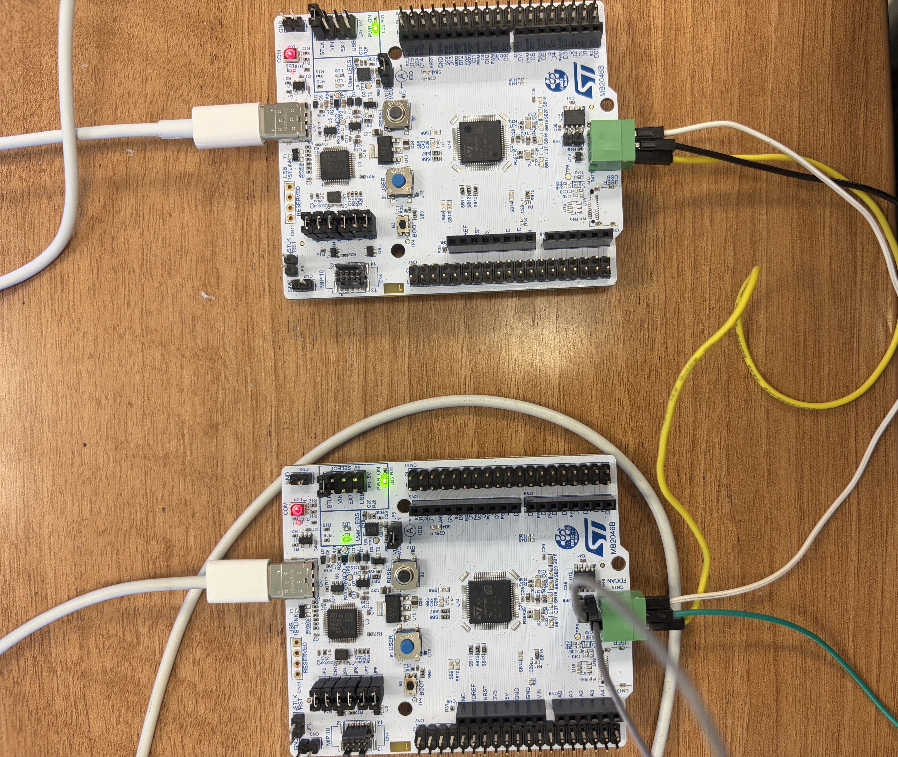

# HW12 - CAN Communication

This folder contains my HW12 work for CAN communication using two STM32 NUCLEO-C092RC boards.

## Overview
In this assignment, two STM32 boards were connected through the CAN bus.  
Each board was programmed to send and receive CAN messages when the USER button was pressed.

The two boards were configured as:

### Board A: Xion
- **TX ID:** `0x121`
- **RX ID:** `0x122`
- **Message:** `hello here is Xion`

### Board B: Ray
- **TX ID:** `0x122`
- **RX ID:** `0x121`
- **Message:** `hello here is Ray`

## Wiring Photo
Below is the physical wiring setup used for this assignment.

## Files
- `main.c` — CAN communication code
- `FDCAN_Com_Polling.ioc` — STM32CubeMX project file
- `HW12.jpg` — physical wiring photo

## Demonstration
When the USER button on one board is pressed:
- that board sends its CAN message,
- the other board receives it,
- the received CAN ID and message content are printed in the serial monitor.

This was tested successfully in both directions.
